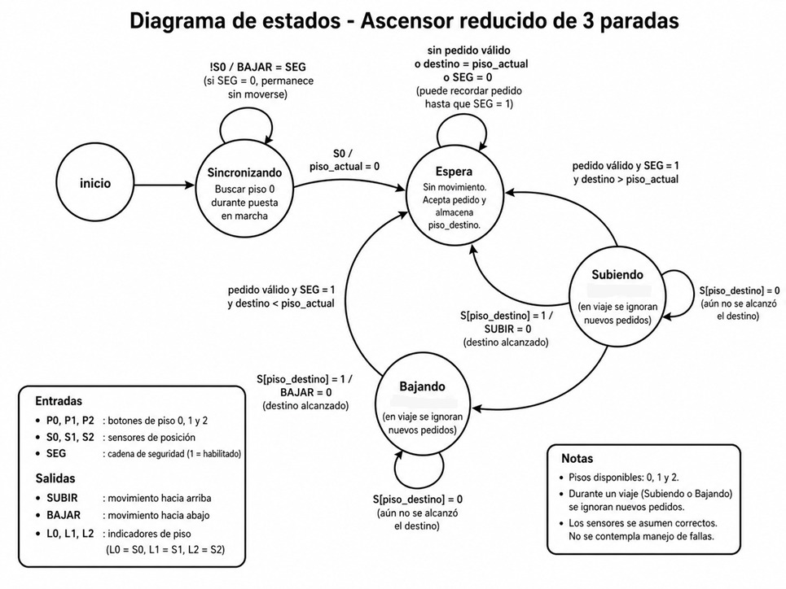

# Proyecto final

## Memoria Descriptiva

Mi sistema representa un control de ascensor reducido, similar a los viejos equipos electromecánicos.

Primero el ascensor comienza buscando el sensor del piso inferior; luego queda habilitado para hacer viajes de forma autónoma.

Si se llama desde un piso distinto al que está la cabina, evalúa si debe subir o bajar. En caso de estar en el mismo piso, ignora el llamado.

Siempre que pase por un piso, actualiza la salida para indicar en qué piso se encuentra.

El sistema también cuenta con dos salidas, que manejan las señales de subida y bajada.

El sistema es un sistema de viaje persistente sin colectivo, lo que quiere decir que mantiene la memoria de a qué piso debe ir si se abre la seguridad, pero no es capaz de retener más de una llamada.

## Diagrama de estados

- **Piso_Actual:** Piso en el que se encuentra la cabina.
- **Destino:** Piso al que debe dirigirse la cabina.
